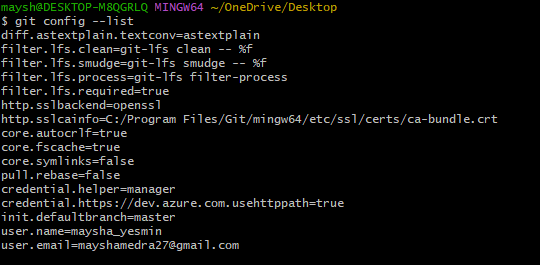
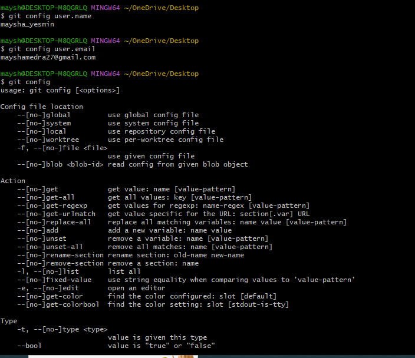
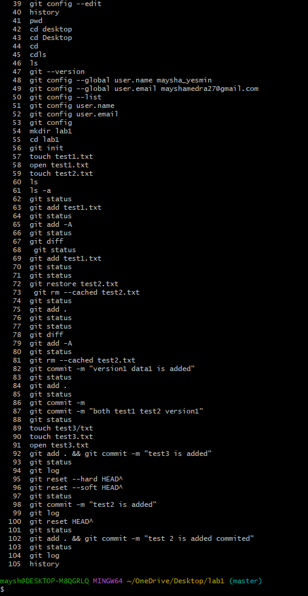
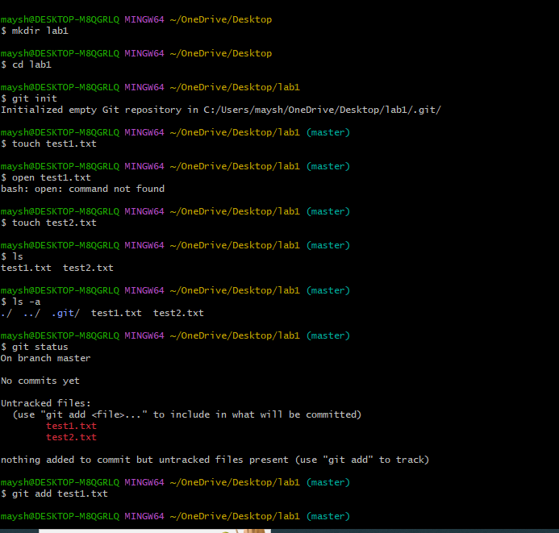

# Study of Different Git Commands

Here we discuss introduction to using bash, the Shell, which is used to interact with our computer via a terminal, and git, a version control software. This will cover the basic git commands.

## 1. Version check
Checks the installed version of Git.


``` bash
git --version
```

## 2. Configuration
* ### Set user Name and Email
``` bash
git config --global user.name "maysha"
git config --global user.email "mayshamedra27@gmail.com"
```
* ### Configuration check
Displays the current Git configuration settings.


``` bash
git config --list
```


* ### Configurationcheck
Displays the current Git configuration settings.


``` bash
git config
```


## 3. Basic Git Commands
*  ## Git initialization

Initializes a new Git repository in the current directory or reinitializes an existing one.

``` bash
git init
```

*  ## Add files

Stages a file, preparing it for the next commit.

``` bash
git add <file_name>
```

*  ## Git commit

Records the changes made to the files in the repository along with a brief commit message. This command creates a new commit with the changes staged in the staging area.

``` bash
git commit -m "<commit_message>"
```


*  ## Git Clone

Clones an existing remote repository to the local machine.


``` bash
git clone <repository_url>
```


*  ## Git status

Displays the status of the working directory and the staging area. This command shows which files are modified, staged, or untracked.

``` bash
git status
```


*  ## Git push

Uploads local commits to a remote repository.


``` bash
git push <remote_name> <branch_name>
```


*  ## Git pull

Fetches and merges changes from a remote repository to the local repository.


``` bash
git pull <remote_name> <branch_name>
```


*  ## Git diff

Shows the changes between the working directory and the staging area or the last commit.


``` bash
git diff
```


*  ## Git Log

Displays a list of commits in the repository, including details such as commit hash, author, date, and message.


``` bash
git log
```


*  ## Git remove

Removes a file from both the working directory and the staging area.


``` bash
git rm <file_name>
```


*  ## List

Displays the list of files in the current directory.


``` bash
ls 
```
Displays all files, including hidden files.


``` bash
ls -a
```


*  ## Reset

Resets the current branch to a specified state, either unstaging changes or moving back to a previous commit.


``` bash
git reset <options>
```


*  ## History
 
Displays the commit history with details of each commit.


``` bash
history
```

## 4.  Basic Bash Commands for File System Navigation

- ## Change Directory
Moves between directories in your file system.

```bash
cd <directory_name>
```
- Move to the parent directory:

```bash
cd ..
```
- Move directly to the home directory:

```bash
cd ~
```
## Make Directory

```bash
mkdir <directory_name>
```


## Remove Directory
Deletes an empty directory.

```bash
rmdir <directory_name>
```

## View Directory Contents
Displays the list of files and subdirectories in a directory.

```bash
dir
```

## Create an Empty File
```bash
touch <file_name>
```

## Remove a File
Deletes a file from the directory.

```bash
rm <file_name>
```


## Echo Command
Displays a line of text or variable value.

```bash
echo <text_or_variable>
```

For example:

```bash
echo "Hello, World!"
```

## Clear Screen
Clears the terminal screen.

```bash
cls
```